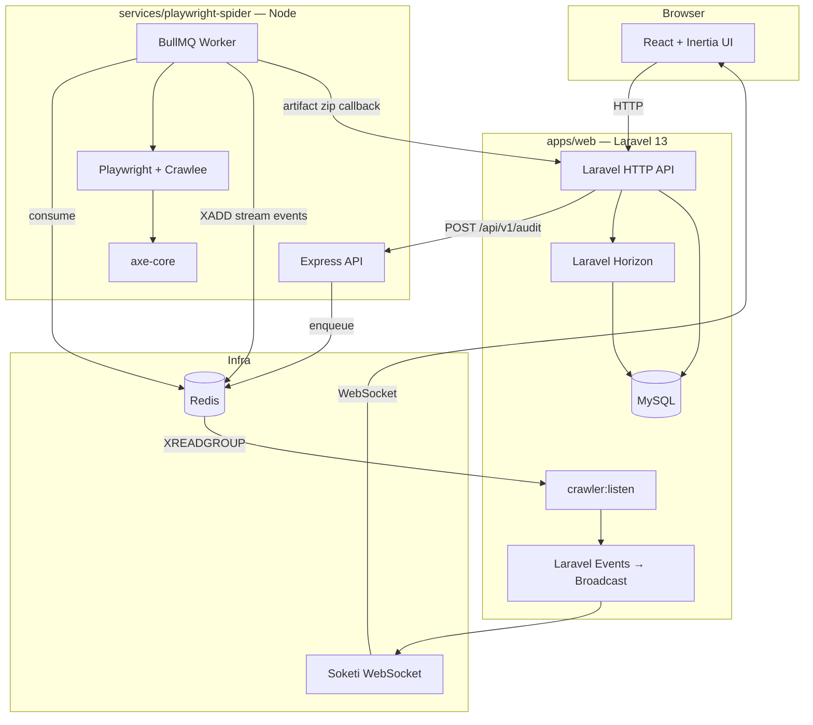

# Equalsite

**Equalsite** is a full-stack web accessibility auditing platform. Users submit a site URL, the system crawls pages with headless browsers, runs WCAG checks via axe-core, streams live scan progress to the UI, and produces an actionable accessibility report with health scores and remediation clusters.

Built as a **pnpm + Turbo monorepo** with a Laravel/React application, a dedicated Node.js crawler service, and shared TypeScript contracts across both runtimes.

---

## Highlights

- **End-to-end accessibility pipeline** — multi-page crawling, axe-core WCAG 2.x / 2.2 AA analysis, violation persistence, and remediation-oriented reporting
- **Event-driven architecture** — Redis Streams bridge the crawler and Laravel; WebSockets (Soketi) push live progress to the browser
- **Polyglot, type-safe integration** — `@equalsite/types` keeps API payloads, stream events, and WebSocket contracts in sync between PHP and Node
- **Production-shaped infrastructure** — Docker Compose stack with MySQL, Redis, Horizon job workers, BullMQ, and a Pusher-compatible WebSocket server
- **Modern frontend** — React 19, Inertia.js 3, Tailwind CSS 4, Radix UI, and real-time updates via Laravel Echo

---

## Architecture



### Audit lifecycle

1. **Submit** — User enters a URL on the scan request page; Laravel creates an `Audit` record and calls the crawler API.
2. **Queue** — The crawler API enqueues a BullMQ job keyed by audit ID.
3. **Crawl & scan** — The worker launches Playwright, follows same-domain links (configurable page limit), and runs axe-core with `wcag2a`, `wcag2aa`, and `wcag22aa` tags on each page.
4. **Stream progress** — Page-level and audit-level events are published to a Redis Stream; Laravel's `crawler:listen` command consumes them, updates audit state, and broadcasts to the browser.
5. **Deliver artifacts** — On completion, the worker zips Crawlee datasets and POSTs them to Laravel's callback endpoint.
6. **Process & report** — A queued job parses axe JSON, upserts violations (with DOM node fingerprints), computes a health score, and renders the remediation report.

### Communication patterns

| Direction | Mechanism | Purpose |
|-----------|-----------|---------|
| Laravel → Crawler | HTTP (`SpiderClient`) | Start / cancel audits |
| Crawler → Laravel (events) | Redis Streams | Real-time progress, status transitions |
| Crawler → Laravel (data) | HTTP multipart callback | Violation datasets (zipped JSON) |
| Laravel → Browser | Soketi / Pusher protocol | Live scan progress UI |

All cross-service HTTP calls are authenticated with a shared `CRAWLER_SECRET` bearer token.

---

## Monorepo layout

```
equalsite/
├── apps/
│   └── web/                    # @equalsite/web — Laravel 13 + React 19 (Inertia)
├── services/
│   └── playwright-spider/      # @equalsite/playwright-spider — Express API + BullMQ worker
├── packages/
│   ├── types/                  # @equalsite/types — shared TS contracts (API, events, WS)
│   ├── eslint-config/          # Shared ESLint presets
│   └── tsconfig/               # Shared TypeScript bases
├── compose.yaml                # Docker Compose stack
├── turbo.json                  # Turbo task pipeline
└── pnpm-workspace.yaml
```

| Package | Stack | Role |
|---------|-------|------|
| `@equalsite/web` | PHP 8.3+, Laravel 13, React 19, Vite 8 | User-facing app, auth, reporting, artifact processing |
| `@equalsite/playwright-spider` | Node, Express 5, Playwright, Crawlee, BullMQ | Headless crawling and axe-core scanning |
| `@equalsite/types` | TypeScript (tsup) | Shared types consumed by both runtimes |

See package-level READMEs for deeper detail:

- [`apps/web/README.md`](apps/web/README.md)
- [`services/playwright-spider/README.md`](services/playwright-spider/README.md)

---

## Tech stack

| Layer | Technologies |
|-------|-------------|
| Monorepo | pnpm workspaces, Turbo 2, TypeScript 5–6 |
| Backend | Laravel 13, Inertia Laravel 3, Fortify (2FA, email verification) |
| Frontend | React 19, Inertia React 3, Vite 8, Tailwind CSS 4, Radix UI |
| Real-time | Laravel Echo, Soketi (Pusher-compatible) |
| Queues | Laravel Horizon, database queue driver; BullMQ (crawler) |
| Crawler | Playwright, Crawlee, axe-core, `@axe-core/playwright` |
| Data | MySQL 8.4, Redis (streams, cache, job queues) |
| Testing | Pest (Laravel), Vitest (crawler) |
| Tooling | ESLint 9, Laravel Pint, Prettier |

---

## Prerequisites

- [Docker](https://docs.docker.com/get-docker/) and Docker Compose
- [pnpm](https://pnpm.io/) 10.x (see `packageManager` in root `package.json`)
- Optional for native dev outside Docker: PHP 8.3+, Composer, Node 22+

---

## Quick start (Docker)

### 1. Configure environment

```bash
cp .env.example .env
```

Set at minimum:

- `APP_KEY` — run `php artisan key:generate` inside the web container after first boot, or generate locally
- `CRAWLER_SECRET` — shared bearer token for crawler ↔ Laravel communication

### 2. Start the stack

```bash
docker compose up -d --build
```

This starts:

| Service | Port | Description |
|---------|------|-------------|
| `web` | 80, 5173 | Laravel + Vite + Horizon (via supervisord) |
| `crawler-api` | 3000 | Crawler HTTP API |
| `crawler-worker` | — | BullMQ worker (Playwright) |
| `mysql` | 3306 | Primary database |
| `redis` | 6379 | Streams, queues, cache |
| `soketi` | 6001 | WebSocket server |

### 3. Run migrations

```bash
docker compose exec web php artisan migrate
```

### 4. Start the stream consumer

The crawler publishes events to Redis Streams. Laravel must consume them for live progress and status updates:

```bash
docker compose exec web php artisan crawler:listen
```

Keep this process running alongside the stack.

### 5. Open the app

Visit [http://localhost](http://localhost) (or the port set in `APP_PORT`).

---

## Development workflow

### Root scripts

```bash
pnpm install          # install all workspace packages; builds @equalsite/types
pnpm dev              # turbo run dev — Vite, crawler API, types watch (parallel)
pnpm build            # turbo run build — production builds
pnpm lint             # eslint across packages
pnpm test             # pest + vitest via turbo
```

### Common Docker commands

```bash
# Shell into the Laravel container
docker compose exec web bash

# Run artisan commands
docker compose exec web php artisan migrate
docker compose exec web php artisan test

# Add a frontend dependency to the web app
pnpm add <package> --filter web
```

### Local (non-Docker) development

Each package can run independently if you provide MySQL, Redis, and Soketi yourself:

```bash
# Terminal 1 — types (optional watch)
pnpm --filter @equalsite/types dev

# Terminal 2 — Laravel (from apps/web)
composer install && php artisan serve
php artisan queue:listen
php artisan crawler:listen

# Terminal 3 — Vite (from apps/web)
pnpm dev

# Terminal 4 — Crawler API
pnpm --filter @equalsite/playwright-spider dev

# Terminal 5 — Crawler worker
pnpm --filter @equalsite/playwright-spider dev:worker
```

Point `.env` at `127.0.0.1` for `DB_HOST`, `REDIS_HOST`, `CRAWLER_HOST`, and `PUSHER_HOST` when running services on the host.

---

## Environment variables

Key variables (see `.env.example` for the full list):

| Variable | Purpose |
|----------|---------|
| `APP_URL`, `APP_KEY` | Laravel application |
| `DB_*` | MySQL connection |
| `REDIS_*` | Redis connection (streams, Horizon, BullMQ) |
| `CRAWLER_HOST`, `CRAWLER_PORT`, `CRAWLER_SECRET` | Crawler API client + callback auth |
| `STREAM_NAME` | Redis stream for crawler events (default: `equalsite:crawler:events`) |
| `PUSHER_*`, `VITE_PUSHER_*` | Soketi / Laravel Echo configuration |

---

## Project structure decisions

**Why a separate crawler service?** Playwright and browser automation are resource-intensive and have different scaling characteristics than a PHP web app. Isolating them behind an API + queue keeps Laravel responsive and allows independent worker scaling.

**Why Redis Streams?** They provide durable, ordered, consumer-group-based event delivery between Node and PHP without tight coupling. Laravel's blocking `XREADGROUP` loop (`crawler:listen`) maps stream events to domain events and WebSocket broadcasts.

**Why shared TypeScript types?** API request/response shapes, stream event enums, and WebSocket payload types are authored once in `@equalsite/types` and imported by both the React frontend and the crawler service, reducing contract drift.

---

## Roadmap / planned work

Scaffolded but not fully wired:

- AI-generated plain-English violation summaries (`OPENAI_*` env vars; columns exist on `audit_violations`)
- Paddle billing integration (`PADDLE_*` env vars)

---

## License

Private project — not licensed for redistribution.
